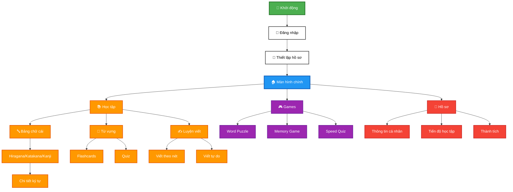

# Ứng Dụng Học Tiếng Nhật - JapaneseApp

Ứng dụng học tiếng Nhật được xây dựng bằng Jetpack Compose với Firebase.

?

## Sơ đồ luồng đơn giản (Dễ đọc)



## Tài Liệu

Thư mục này chứa các tài liệu về thiết kế và cấu trúc ứng dụng:

- [DATABASE_STRUCTURE.md](./DATABASE_STRUCTURE.md): Mô tả cấu trúc cơ sở dữ liệu Firebase
- [FIREBASE_RULES.md](./FIREBASE_RULES.md): Quy tắc bảo mật cho Firebase Realtime Database

## Cấu Trúc Ứng Dụng

Ứng dụng được phát triển theo mô hình MVVM (Model-View-ViewModel) với các thành phần chính:

### 1. Màn Hình (Screens)

#### 🔐 Xác Thực
- **SplashScreen**: Màn hình khởi động với logo ứng dụng
- **LoginScreen**: Đăng nhập với email/password thông qua Firebase Authentication
- **RegisterScreen**: Đăng ký tài khoản mới
- **UserProfileSetupScreen**: Thiết lập hồ sơ người dùng sau khi đăng ký

#### 🏠 Chính & Điều Hướng
- **MainScreen**: Màn hình chính với bottom navigation
- **HomeScreen**: Dashboard hiển thị các bài học và chức năng
- **LearnScreen**: Tab học tập với các danh mục
- **ProfileScreen**: Hiển thị thông tin người dùng và tiến độ học tập
- **EditProfileScreen**: Chỉnh sửa thông tin cá nhân

#### 📚 Học Tập
- **AlphabetScreen**: Hiển thị bảng chữ cái Hiragana, Katakana và Kanji
- **FlashcardLearningScreen**: Học từ vựng qua thẻ ghi nhớ
- **CategoryLevelScreen**: Chọn cấp độ cho từng danh mục
- **CategoryDetailScreen**: Chi tiết nội dung trong danh mục

#### ✍️ Luyện Viết
- **WritingScreen**: Màn hình luyện viết ký tự tiếng Nhật
- **WritingSettings**: Cài đặt cho chế độ luyện viết

#### 🎮 Games & Giải Trí
- **GameScreen**: Màn hình chơi mini games
- **QuizScreen**: Bài kiểm tra kiến thức
- **QuizDetailScreen**: Chi tiết câu hỏi quiz

#### 📊 Theo Dõi & Thống Kê
- **LevelProgressionScreen**: Theo dõi tiến độ học tập chi tiết
- **StatusScreen**: Thống kê tổng quan hiệu suất học tập

### 2. ViewModel

#### 🔐 Xác Thực & Hồ Sơ
- **AuthViewModel**: Quản lý xác thực người dùng (đăng nhập, đăng ký, đăng xuất)
- **UserProfileViewModel**: Quản lý hồ sơ người dùng và tương tác với Firebase Realtime Database

#### 📚 Học Tập & Nội Dung
- **JapaneseAlphabetViewModel**: Quản lý dữ liệu bảng chữ cái và chi tiết ký tự
- **FlashcardViewModel**: Quản lý dữ liệu và trạng thái cho thẻ ghi nhớ
- **FlashcardRecommendationViewModel**: Gợi ý flashcards phù hợp với trình độ
- **QuizViewModel**: Quản lý dữ liệu và trạng thái cho bài kiểm tra

#### ✍️ Luyện Viết
- **WritingViewModel**: Quản lý trạng thái và logic luyện viết ký tự

#### 🎮 Games & Giải Trí
- **GameViewModel**: Quản lý trạng thái và logic cho mini games

#### 📊 Tiến Độ & Hệ Thống
- **LevelSystemViewModel**: Quản lý hệ thống cấp độ và tiến độ học tập

### 3. Models

#### 👤 Người Dùng & Hồ Sơ
- **UserProfileData**: Dữ liệu hồ sơ người dùng
- **UserLevelInfo**: Thông tin cấp độ và tiến độ người dùng

#### 📝 Nội Dung Học Tập
- **JapaneseCharacter**: Dữ liệu ký tự tiếng Nhật (Hiragana, Katakana, Kanji)
- **Flashcard**: Dữ liệu thẻ ghi nhớ từ vựng
- **Example**: Dữ liệu ví dụ sử dụng từ/ký tự
- **Lesson**: Dữ liệu bài học
- **Category**: Danh mục nội dung học
- **QuizModels**: Dữ liệu câu hỏi và bài kiểm tra

#### ✍️ Luyện Viết
- **WritingModels**: Models cho luyện viết ký tự (WritingCharacter, Stroke, WritingProgress)
- **WritingSettings**: Cài đặt chế độ luyện viết

#### 🎮 Games
- **GameModels**: Models cho mini games (GameQuestion, GameResult, PlayerStats)
- **GameAchievement**: Hệ thống thành tích trong game

### 4. Components

#### 📚 Học Tập Cơ Bản
- **JapaneseCharacterComponent**: Hiển thị ký tự tiếng Nhật và chi tiết
- **FlashcardComponent**: Hiển thị thẻ ghi nhớ từ vựng
- **RecommendedFlashcardComponent**: Gợi ý flashcards phù hợp
- **QuizComponent**: Hiển thị câu hỏi và đáp án
- **CategoryCardComponent**: Hiển thị thẻ danh mục học tập
- **ProgressComponent**: Hiển thị tiến độ học tập

#### ✍️ Luyện Viết
- **WritingSettingsComponent**: Cài đặt chế độ luyện viết
- **StrokeWritingComponent**: Luyện viết theo từng nét
- **FreeWritingComponent**: Luyện viết tự do
- **BoldWritingCanvas**: Canvas vẽ ký tự với nét đậm

#### 🎮 Mini Games
- **WordPuzzleGame**: Game ghép từ thành câu
- **MemoryGameComponent**: Game ghép từ với nghĩa
- **SpeedQuizComponent**: Game trả lời nhanh

### 5. Navigation

- **AppNavigation**: Quản lý điều hướng giữa các màn hình trong ứng dụng

## Công Nghệ Sử Dụng

### 🎨 UI & Framework
- **Jetpack Compose**: UI toolkit hiện đại cho Android với Material Design 3
- **Material Design 3**: Design system hiện đại với dynamic colors
- **Navigation Compose**: Điều hướng type-safe cho Compose

### 🏗️ Architecture & State Management
- **MVVM Architecture**: Model-View-ViewModel pattern
- **ViewModel & StateFlow**: Quản lý trạng thái ứng dụng reactive
- **Repository Pattern**: Tách biệt data layer và business logic
- **Coroutines & Flow**: Xử lý bất đồng bộ và reactive programming

### 🔥 Backend & Database
- **Firebase Authentication**: Quản lý xác thực người dùng
- **Firebase Realtime Database**: Lưu trữ dữ liệu ứng dụng real-time
- **Firebase Storage**: Lưu trữ hình ảnh và assets

### 🎨 UI Components & Libraries
- **Coil**: Tải và hiển thị hình ảnh hiệu suất cao
- **Custom Canvas**: Vẽ và xử lý gesture cho luyện viết
- **Lottie Animations**: Animation đẹp mắt cho UI
- **Accompanist**: Thư viện hỗ trợ Compose (Pager, SwipeRefresh)

### 🎮 Game & Interactive Features
- **Custom Game Engine**: Engine mini games tự xây dựng
- **Gesture Recognition**: Nhận diện cử chỉ viết tay
- **Canvas Drawing**: Vẽ và xử lý touch events
- **Sound Effects**: Âm thanh và feedback cho games

### 📊 Analytics & Performance
- **Firebase Analytics**: Theo dõi hành vi người dùng
- **Firebase Crashlytics**: Báo cáo crash và lỗi
- **Performance Monitoring**: Giám sát hiệu suất ứng dụng

## Cơ Sở Dữ Liệu

Xem chi tiết cấu trúc cơ sở dữ liệu tại [DATABASE_STRUCTURE.md](./DATABASE_STRUCTURE.md)

## Tính Năng Chính

### 🔐 Xác Thực & Hồ Sơ
1. **Xác thực người dùng**: Đăng ký, đăng nhập, đăng xuất với Firebase
2. **Thiết lập hồ sơ**: Cá nhân hóa trải nghiệm học tập
3. **Chỉnh sửa hồ sơ**: Cập nhật thông tin cá nhân và mục tiêu học tập

### 📚 Học Tập Cơ Bản
4. **Học bảng chữ cái**: Hiragana, Katakana và Kanji cơ bản
5. **Chi tiết ký tự Kanji**: Hiển thị nghĩa, âm On, âm Kun và các ví dụ sử dụng
6. **Thứ tự nét viết**: Hiển thị thứ tự nét viết cho Hiragana và Katakana
7. **Bài học từ vựng**: Theo cấp độ từ N5 đến N1
8. **Flashcards**: Học từ vựng qua thẻ ghi nhớ với hệ thống Spaced Repetition
9. **Quizzes**: Bài kiểm tra kiến thức với nhiều dạng câu hỏi

### ✍️ Luyện Viết Tiếng Nhật
10. **Luyện viết ký tự**: Luyện viết Hiragana, Katakana và Kanji
11. **Chế độ viết theo nét**: Hướng dẫn viết từng nét một cách chi tiết
12. **Chế độ tự do**: Viết tự do ký tự hoàn chỉnh
13. **Đánh giá độ chính xác**: Phân tích và chấm điểm cách viết
14. **Cài đặt luyện viết**: Tùy chỉnh đường kẻ, độ dày nét, âm thanh

### 🎮 Mini Games
15. **Word Puzzle Game**: Ghép từ thành câu tiếng Nhật
16. **Memory Game**: Ghép từ tiếng Nhật với nghĩa
17. **Speed Quiz**: Trả lời nhanh câu hỏi tiếng Nhật
18. **Game Leaderboard**: Bảng xếp hạng người chơi
19. **Hệ thống thành tích**: Unlock achievements khi hoàn thành mục tiêu

### 📊 Theo Dõi & Tiến Độ
20. **Hệ thống cấp độ**: Progression từ N5 đến N1
21. **Theo dõi tiến độ**: Số từ học được, bài học hoàn thành, streak
22. **Thống kê chi tiết**: Phân tích hiệu suất học tập
23. **Cá nhân hóa**: Điều chỉnh mục tiêu và thời gian học
24. **Level Progression**: Màn hình theo dõi tiến độ học tập chi tiết

## Web Admin Panel

Ứng dụng bao gồm một web admin panel hiện đại để quản lý nội dung và người dùng:

### Tính Năng Web Admin:
1. **Quản lý từ vựng**: Thêm, sửa, xóa từ vựng tiếng Nhật
2. **Quản lý bài học**: Tạo và chỉnh sửa bài học
3. **Quản lý danh mục**: Phân loại nội dung học tập
4. **Quản lý người dùng**: Xem thống kê và tiến độ học tập
5. **Quản lý thành tích**: Tạo và quản lý hệ thống thành tích
6. **Thống kê**: Phân tích dữ liệu người dùng và hiệu suất

### Giao Diện Web Admin:
- **Modern Design**: Header gradient với hiệu ứng shimmer
- **Dark/Light Theme**: Chuyển đổi giao diện sáng/tối
- **Responsive**: Tối ưu cho mọi thiết bị
- **Real-time Status**: Hiển thị trạng thái kết nối Firebase
- **User-friendly**: Giao diện thân thiện, dễ sử dụng

### Công Nghệ Web Admin:
- **HTML5/CSS3**: Giao diện hiện đại với animations
- **Bootstrap 5**: Framework responsive
- **JavaScript ES6+**: Logic xử lý và tương tác
- **Firebase SDK**: Kết nối trực tiếp với database
- **Font Awesome**: Icons đẹp mắt

## Hướng Phát Triển

1. **Offline Mode**: Hỗ trợ học tập khi không có mạng
2. **Gamification**: Thêm yếu tố trò chơi để tăng động lực học tập
3. **Nhận dạng viết tay**: Luyện tập viết chữ Nhật
4. **Phát âm**: Nghe và luyện phát âm
5. **Ngữ pháp**: Bài học ngữ pháp tiếng Nhật
6. **Web Admin Enhancements**: 
   - Dashboard analytics
   - Content management system
   - User progress tracking
   - Export/Import data features

## Cài Đặt

```
git clone <repository-url>
cd composeapp
```

## Cấu Hình Firebase

1. Tạo dự án Firebase mới tại https://console.firebase.google.com/
2. Thêm ứng dụng Android vào dự án
3. Tải file google-services.json và đặt vào thư mục app/
4. Bật Firebase Authentication và Realtime Database

## Sử Dụng Web Admin Panel

### Truy Cập Web Admin:
1. Mở file `web-admin/index.html` trong trình duyệt
2. Web admin sẽ tự động kết nối với Firebase
3. Sử dụng các tab để quản lý nội dung

### Các Chức Năng Chính:

#### 1. Quản Lý Từ Vựng:
- Thêm từ vựng mới với độ khó và hình ảnh
- Chỉnh sửa thông tin từ vựng hiện có
- Xóa từ vựng không cần thiết
- Lọc theo danh mục và cấp độ

#### 2. Quản Lý Người Dùng:
- Xem danh sách tất cả người dùng
- Theo dõi tiến độ học tập
- Xem thống kê flashcards và quiz
- Chi tiết hồ sơ người dùng

#### 3. Quản Lý Nội Dung:
- Tạo bài học mới
- Quản lý danh mục
- Thiết lập thành tích
- Tạo câu hỏi quiz

### Giao Diện:
- **Dark/Light Theme**: Nhấn nút "Giao diện" để chuyển đổi
- **Real-time Status**: Theo dõi trạng thái kết nối Firebase
- **Responsive Design**: Hoạt động tốt trên mọi thiết bị 
