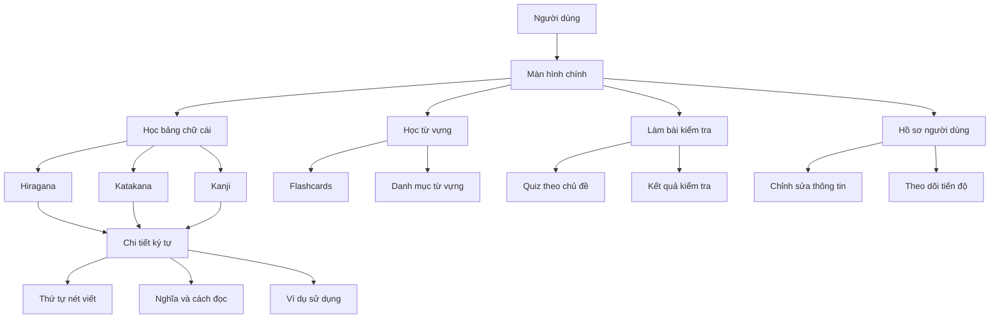

# Ứng Dụng Học Tiếng Nhật - JapaneseApp

Ứng dụng học tiếng Nhật được xây dựng bằng Jetpack Compose với Firebase.

## Sơ đồ luồng ứng dụng



## Tài Liệu

Thư mục này chứa các tài liệu về thiết kế và cấu trúc ứng dụng:

- [DATABASE_STRUCTURE.md](./DATABASE_STRUCTURE.md): Mô tả cấu trúc cơ sở dữ liệu Firebase
- [FIREBASE_RULES.md](./FIREBASE_RULES.md): Quy tắc bảo mật cho Firebase Realtime Database

## Cấu Trúc Ứng Dụng

Ứng dụng được phát triển theo mô hình MVVM (Model-View-ViewModel) với các thành phần chính:

### 1. Màn Hình (Screens)

- **LoginScreen**: Đăng nhập với email/password thông qua Firebase Authentication
- **RegisterScreen**: Đăng ký tài khoản mới
- **UserProfileSetupScreen**: Thiết lập hồ sơ người dùng sau khi đăng ký
- **HomeScreen**: Màn hình chính hiển thị các bài học và chức năng
- **ProfileScreen**: Hiển thị thông tin người dùng và tiến độ học tập
- **EditProfileScreen**: Chỉnh sửa thông tin cá nhân
- **AlphabetScreen**: Hiển thị bảng chữ cái Hiragana, Katakana và Kanji
- **FlashcardLearningScreen**: Học từ vựng qua thẻ ghi nhớ

### 2. ViewModel

- **AuthViewModel**: Quản lý xác thực người dùng (đăng nhập, đăng ký, đăng xuất)
- **UserProfileViewModel**: Quản lý hồ sơ người dùng và tương tác với Firebase Realtime Database
- **HomeViewModel**: Quản lý dữ liệu cho màn hình chính
- **JapaneseAlphabetViewModel**: Quản lý dữ liệu bảng chữ cái và chi tiết ký tự
- **FlashcardViewModel**: Quản lý dữ liệu và trạng thái cho thẻ ghi nhớ
- **QuizViewModel**: Quản lý dữ liệu và trạng thái cho bài kiểm tra

### 3. Models

- **UserProfileData**: Dữ liệu hồ sơ người dùng
- **JapaneseCharacter**: Dữ liệu ký tự tiếng Nhật (Hiragana, Katakana, Kanji)
- **Flashcard**: Dữ liệu thẻ ghi nhớ từ vựng
- **Example**: Dữ liệu ví dụ sử dụng từ/ký tự
- **Lesson**: Dữ liệu bài học
- **Category**: Danh mục nội dung học

### 4. Components

- **JapaneseCharacterComponent**: Hiển thị ký tự tiếng Nhật và chi tiết
- **FlashcardComponent**: Hiển thị thẻ ghi nhớ từ vựng
- **QuizComponent**: Hiển thị câu hỏi và đáp án
- **CategoryCardComponent**: Hiển thị thẻ danh mục học tập
- **ProgressComponent**: Hiển thị tiến độ học tập

### 5. Navigation

- **AppNavigation**: Quản lý điều hướng giữa các màn hình trong ứng dụng

## Công Nghệ Sử Dụng

- **Jetpack Compose**: UI toolkit hiện đại cho Android 
- **ViewModel & StateFlow**: Quản lý trạng thái ứng dụng
- **Firebase Authentication**: Quản lý xác thực người dùng
- **Firebase Realtime Database**: Lưu trữ dữ liệu ứng dụng
- **Coroutines**: Xử lý bất đồng bộ
- **Coil**: Tải và hiển thị hình ảnh

## Cơ Sở Dữ Liệu

Xem chi tiết cấu trúc cơ sở dữ liệu tại [DATABASE_STRUCTURE.md](./DATABASE_STRUCTURE.md)

## Tính Năng Chính

1. **Xác thực người dùng**: Đăng ký, đăng nhập, đăng xuất
2. **Thiết lập hồ sơ**: Cá nhân hóa trải nghiệm học tập
3. **Học bảng chữ cái**: Hiragana, Katakana và Kanji cơ bản
4. **Chi tiết ký tự Kanji**: Hiển thị nghĩa, âm On, âm Kun và các ví dụ sử dụng
5. **Thứ tự nét viết**: Hiển thị thứ tự nét viết cho Hiragana và Katakana
6. **Bài học từ vựng**: Theo cấp độ từ N5 đến N1
7. **Flashcards**: Học từ vựng qua thẻ ghi nhớ
8. **Quizzes**: Bài kiểm tra kiến thức
9. **Theo dõi tiến độ**: Số từ học được, bài học hoàn thành, streak
10. **Cá nhân hóa**: Điều chỉnh mục tiêu và thời gian học

## Hướng Phát Triển

1. **Offline Mode**: Hỗ trợ học tập khi không có mạng
2. **Gamification**: Thêm yếu tố trò chơi để tăng động lực học tập
3. **Nhận dạng viết tay**: Luyện tập viết chữ Nhật
4. **Phát âm**: Nghe và luyện phát âm
5. **Ngữ pháp**: Bài học ngữ pháp tiếng Nhật

## Cài Đặt

```
git clone <repository-url>
cd composeapp
```

## Cấu Hình Firebase

1. Tạo dự án Firebase mới tại https://console.firebase.google.com/
2. Thêm ứng dụng Android vào dự án
3. Tải file google-services.json và đặt vào thư mục app/
4. Bật Firebase Authentication và Realtime Database 